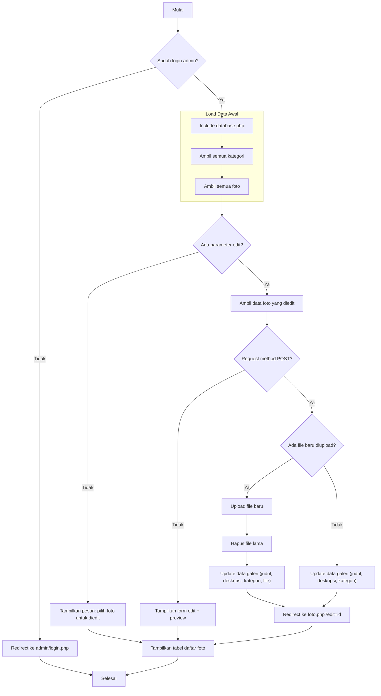

```mermaid
    flowchart TD
    
    A[Mulai] --> B{Sudah login admin?}
    B -- Tidak --> C[Redirect ke admin/login.php] --> Z[Selesai]
    B -- Ya --> D[Include database.php]

    subgraph LoadData [Load Data Awal]
        D --> E[Ambil semua kategori]
        E --> F[Ambil semua foto]
    end

    F --> G{Ada parameter edit?}
    G -- Tidak --> H[Tampilkan pesan: pilih foto untuk diedit]
    G -- Ya --> I[Ambil data foto yang diedit]

    I --> J{Request method POST?}
    J -- Tidak --> K[Tampilkan form edit + preview]
    J -- Ya --> L{Ada file baru diupload?}
    
    L -- Ya --> M[Upload file baru] --> N[Hapus file lama] --> O["Update data galeri (judul, deskripsi, kategori, file)"]
    L -- Tidak --> P["Update data galeri (judul, deskripsi, kategori)"]

    O --> Q[Redirect ke foto.php?edit=id]
    P --> Q

    H --> R[Tampilkan tabel daftar foto]
    K --> R
    Q --> R

    R --> Z[Selesai]
```