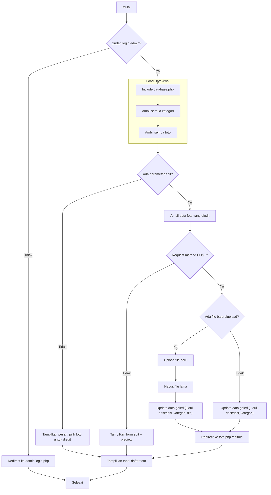
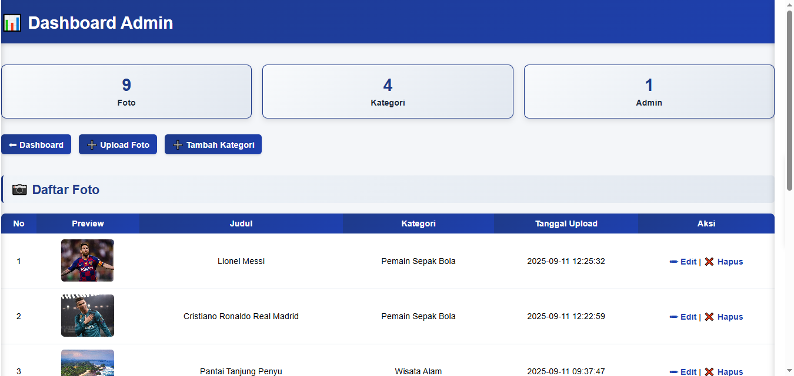
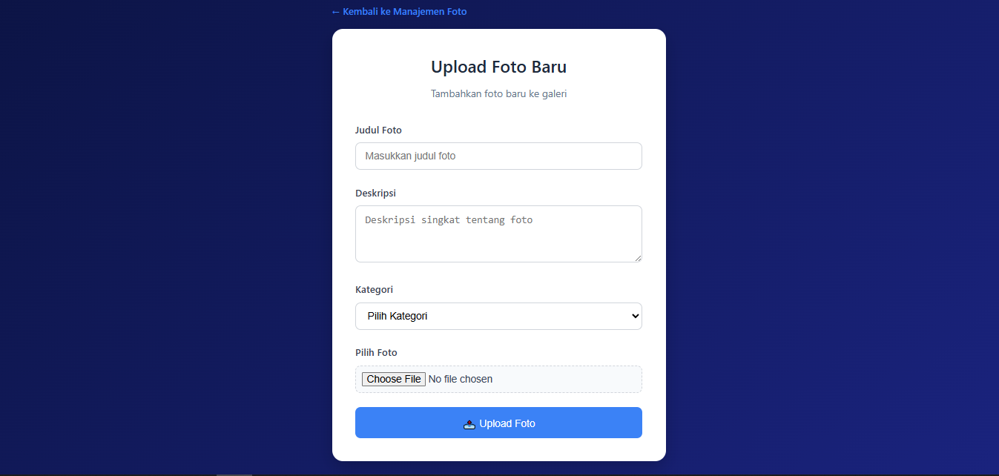

# 📸 Galeri Foto - Dashboard Admin

Web **Galeri Foto** ini adalah aplikasi web sederhana berbasis PHP dan MySQL untuk mengelola koleksi foto beserta kategorinya. Admin dapat mengunggah, mengedit, menghapus foto, serta mengelola kategori dan melihat statistik galeri.

---

## ✨ Fitur Utama

- **Manajemen Foto:**  
  - Upload foto baru beserta judul, deskripsi, dan kategori.
  - Edit detail foto dan ganti file foto.
  - Hapus foto dari galeri.

- **Manajemen Kategori:**  
  - Tambah kategori baru.
  - Edit nama kategori.
  - Hapus kategori.

- **Statistik:**  
  - Lihat jumlah total foto, kategori, dan admin.

- **Keamanan:**  
  - Hanya admin yang sudah login yang dapat mengakses dashboard.

- **UI Modern:**  
  - Tampilan dashboard responsif dan mudah digunakan.
  - Panel edit/tambah kategori dan foto dengan efek slide.

---

## 🗂️ Struktur Folder

```
galeri-foto/
│
├── admin/
│   ├── foto.php         # Dashboard admin (manajemen foto & kategori)
│   ├── upload.php       # Form upload foto baru
│   ├── delete.php       # Proses hapus foto
│   ├── login.php        # Halaman login admin
│   └── ...              # File admin lainnya
│
├── uploads/             # Folder penyimpanan file foto
├── database.php         # Koneksi database
├── index.php            # Halaman utama galeri (untuk user)
└── readme.md            # Dokumentasi proyek
```

---

## 🚀 Cara Instalasi & Menjalankan

1. **Clone atau download** repositori ini ke server lokal Anda (misal: `c:\laragon\www\galeri-foto`).
2. **Import database**  
   - Buat database MySQL, lalu import struktur tabel sesuai kebutuhan (`galeri`, `kategori`, `admin`).
3. **Konfigurasi koneksi database**  
   - Edit file `database.php` dan sesuaikan dengan konfigurasi MySQL Anda.
4. **Akses aplikasi**  
   - Buka `http://localhost/galeri-foto/admin/login.php` untuk login sebagai admin.
   - Setelah login, Anda akan diarahkan ke dashboard admin untuk mengelola galeri.

---


---

## 👤 Hak Akses

- **Admin:**  
  - Dapat mengelola semua data (foto, kategori, admin).
  - Wajib login sebelum mengakses dashboard.

---

## 📢 Catatan

- Pastikan folder `uploads/` dapat ditulisi (writeable) oleh web server.
- Untuk keamanan, gunakan password yang kuat untuk akun admin.
- Kode ini dapat dikembangkan lebih lanjut sesuai kebutuhan (misal: fitur multi-user, komentar, dsb).

---

## 🛠️ Lisensi

Proyek ini bersifat open-source. Silakan gunakan, modifikasi, dan distribusikan sesuai kebutuhan Anda.

---

**Dibuat dengan ❤️ oleh [Syahrul Adzim]**


## 📝 Flowchart Proses Utama


---
 
 

---